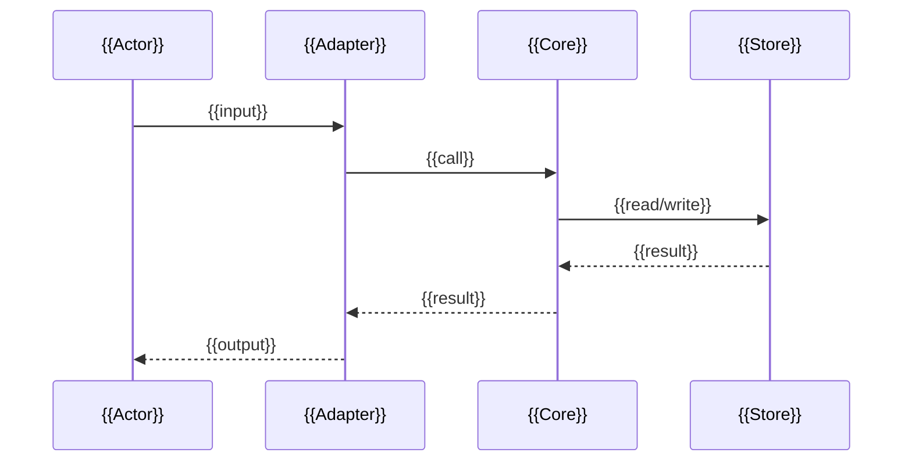

# {{PROJECT_NAME}} — Architecture

<!-- Written by project-kickoff, Phase 4. Read before adding a module, changing a boundary, or when the user asks how data moves. Keep the module map and sequence diagrams true; /wrap checks them when a slice lands. -->

## Module map

| Module | Owns | Receives | Emits |
|---|---|---|---|
| {{MODULE}} | {{RESPONSIBILITY}} | {{INPUTS_FROM}} | {{OUTPUTS_TO}} |

<!-- One row per meaningful unit. If a row is hard to write, the boundary is wrong — fix the boundary, not the row. -->

## Containers

```mermaid
flowchart LR
    {{ENTRY}}[{{Entry point}}] --> {{CORE}}[{{Core}}]
    {{CORE}} --> {{STORE}}[({{Persistence}})]
    {{CORE}} --> {{EXT}}[{{External API}}]
```

## Sequences

<!-- One per primary use case. These are how the user understands flow; keep them at the level of modules, not functions. -->

### When {{USER_DOES_X}}



## Core and adapters

- **Core:** {{PATH}} — the logic. Depends on nothing outside itself except the ports below.
- **Ports (interfaces the core defines):** {{PORT}} — {{WHAT_IT_ABSTRACTS}}
- **Adapters (implementations of ports):**
  - {{ADAPTER}} → {{PORT}} ({{CLI_HTTP_DB_API}})

Rule: nothing outside the core imports from inside it except through a port. Nothing inside the core imports an adapter.

## Where a new file goes

<!-- The layers and the one direction dependencies point. Each forbidden arrow becomes a dependency rule in the check command (docs/trust.md). Read before adding a file. -->

Dependencies point {{DIRECTION — e.g. inward: adapters → core, never core → adapters}}.

| Kind of code | Goes in | May import from |
|---|---|---|
| {{KIND — e.g. business rules, pricing, validation}} | `{{PATH}}` | {{LAYERS_OR_NOTHING}} |
| {{KIND — e.g. HTTP handlers, CLI commands}} | `{{PATH}}` | {{LAYERS}} |
| {{KIND — e.g. database, external API clients}} | `{{PATH}}` | {{LAYERS}} |

A file that could sit in two rows is a boundary finding — fix the table or the file. The names in the module map above are the names in the code.

## Interfaces

- **Primary interface, day one:** {{CLI_REPL_OR_HTTP}} — `{{HOW_TO_INVOKE}}`
- **UI plan:** {{WHAT_A_UI_WOULD_SHOW}}, using ports {{PORTS}}. Status: {{BUILT_IN_V1_OR_PLANNED_ONLY}} — {{WHY}}.

## Observability

- **Logging:** structured ({{FORMAT}}), via {{LIBRARY_OR_APPROACH}}
- **Debug mode:** `{{HOW_TO_ENABLE}}` — logs each step of the sequences above with the data at each hop

## Build order

Vertical slices, thin and end to end. Never a full layer before the next slice.

1. **Walking skeleton:** {{THINNEST_PATH}} — tested, deployed to {{TARGET}}
2. {{SLICE_2}}
3. {{SLICE_3}}
4. {{SLICE_4}}

## Generated graph

<!-- Delete if the ecosystem has no tool for it. -->

`{{COMMAND}}` writes the actual import graph to `{{OUTPUT_PATH}}`. The diagrams above are intent; this one is truth. When they disagree, one of them is a finding.
